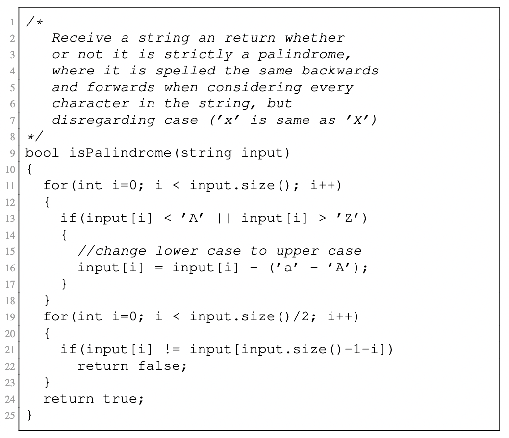
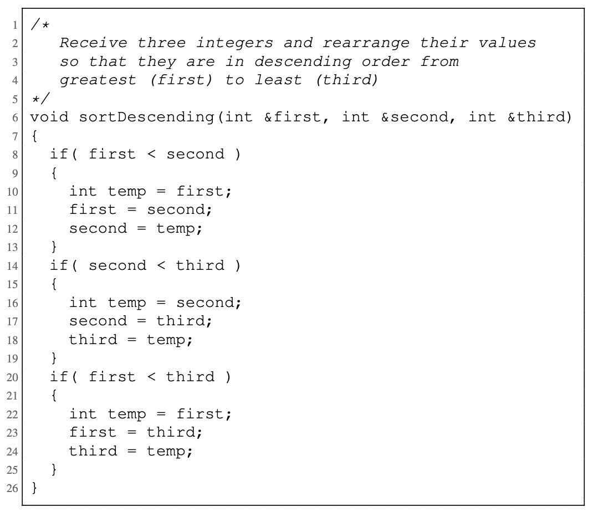

```{r setup, include=FALSE}
knitr::opts_chunk$set(echo = FALSE)
```
        
## Presentation

Presented at the [International Conference on Software Engineering](https://conf.researchr.org/home/icse-2023) in Melbourne, Australia and published in proceedings.

This presentation is accessible at [learnbyfailure.com/CognitiveReflection](https://learnbyfailure.com/CodeVid/) 
and its source is available on [GitHub](https://github.com/kbuffardi/CognitiveReflection/).

## Thinking Fast, and Slow

## Behavioral Economics

The **Cognitive Reflection Test** ([Frederick
2005](https://doi.org/10.1257%2F089533005775196732)) was motivated by
Tversky and Kahneman’s research that lead to a Nobel Prize in Economics.
They identified how consumers do not act in their rational best
interests because of cognitive biases.


Photo courtesy of Proximus.be

In Kahneman’s best-selling book *Thinking, Fast and Slow* he described
our brain’s two systems of decision-making:

-   **System 1** is fast and reflexive and particularly susceptible to
    our emotions and intuitions
-   **System 2** is slower, deliberate, and utilizes conscious
    calculations and reasoning

The **Cognitive Reflection Test** is a proxy for how likely an
individual is to inhibit System 1 and demonstrate **Cognitive
Reflection** (using System 2). It is inversely correlated with:

-   Gambler’s fallacy
-   Sunk cost fallacy

**In what ways might “Cognitive Reflection” play a role in software
engineering?**

## Inspecting Code

Does this function produce the described behavior?



Does this function produce the described behavior?



## Testing

**Test outcomes vs. Implementation**

<table>
<thead>
<tr class="header">
<th style="text-align: right;"></th>
<th style="text-align: right;">Fail</th>
<th style="text-align: right;">Pass</th>
</tr>
</thead>
<tbody>
<tr class="odd">
<td style="text-align: right;">Working</td>
<td style="text-align: right;">🤨</td>
<td style="text-align: right;">🙌</td>
</tr>
<tr class="even">
<td style="text-align: right;">Buggy</td>
<td style="text-align: right;">🧐</td>
<td style="text-align: right;">🪳</td>
</tr>
</tbody>
</table>


# Results

## CRT vs Inspection

-   CRT was **not a significant predictor** (p=0.329) of students’
    **affirmation of acceptable code**.
-   CRT was a **significant predictor** of students rejecting defective
    code (p&lt;0.0001) with the log odds of **correctly rejecting the
    defective code** increasing by 2.94 (95% CI 1.56-4.50).
    -   When considering only students who proposed cases that caused a
        defect, we found that **CRT was a significant predictor**
        (p&lt;0.001) of students **identifying a defective case** with
        the log odds of doing so increasing by 2.37 (95% CI 1.05-3.86)

## CRT vs Testing

-   CRT was **not correlated with test accuracy** (ρ=0.940, p=0.008).
    -   Test effectiveness (M=0.66, sd=0.27) was **not correlated with
        CRT** (ρ=0.140, p=0.159)
    -   Test affirmation (M=0.76, sd=0.17) was **not correlated with
        CRT** (ρ= -0.199, p=0.045)

## Conclusions

**How would you interpret the results?**

# Full Paper

The full paper will be available soon.
